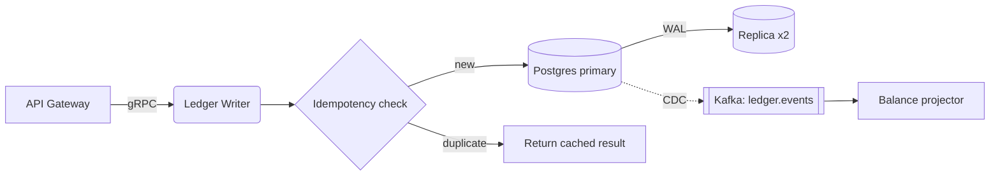

+++
title = "Ledger Service v3 Design"
status = "RFC"
+++

# Ledger Service v3: Design Specification

**Status:** RFC &middot; **Owners:** Platform Payments &middot; **Last updated:** 2026-09-25

## Contents

1. [Goals](#goals)
2. [Architecture](#architecture)
3. [Consistency model](#consistency-model)
4. [Capacity planning](#capacity-planning)

## Goals

- Double-entry correctness: every transaction satisfies $\sum_i d_i = \sum_j c_j$.
- p99 write latency under **25 ms** at 12k TPS.
- Zero data loss (RPO = 0), RTO under 5 minutes.

## Architecture



```mermaid
sequenceDiagram
    participant C as Client
    participant L as Ledger
    participant DB as Postgres
    C->>L: PostTransaction(idempotency_key)
    L->>DB: BEGIN; INSERT entries; COMMIT
    DB-->>L: ok
    L-->>C: 201 Created
```

## Consistency model

Balances are derived, never stored as the source of truth:

$$
B_a(t) = \sum_{e \in E_a,\; t_e \le t} \operatorname{sign}(e)\cdot \text{amount}(e)
$$

Inline math with a dollar sign in prose: the fee is \$0.30 plus $2.9\%$ of $x$.

> **Note**
> Using `SERIALIZABLE` isolation costs roughly 18% throughput in our benchmark[^bench]; we accept this.

## Capacity planning

| Metric | Today | 2027 target | Growth |
|--------|------:|------------:|-------:|
| TPS (peak) | 3,100 | 12,000 | 3.9x |
| Entries/day | 190M | 740M | 3.9x |
| Storage/yr | 2.1 TB | 8.4 TB | 4.0x |

Estimated storage: $S = N \times 2 \times 312\ \text{bytes} \approx 8.4\ \text{TB}$.

### Term definitions

<dl>
  <dt>Entry</dt>
  <dd>A single debit or credit line.</dd>
  <dt>Posting</dt>
  <dd>A balanced set of entries.</dd>
</dl>

### Open questions

- [ ] Partition by `account_id` hash or by tenant?
- [ ] Do we need cross-region active-active in v3?
  - [ ] Legal input on data residency (EU, SG)
  - [x] Latency budget measured (see [benchmarks](./bench/README.md "Benchmark results"))

Reference-style image: ![latency chart][chart]

[chart]: ./img/p99-latency.png
[^bench]: pgbench, 64 clients, `r6i.4xlarge`, 2026-09-10.

<!-- reviewer: please check the RPO claim against the DR runbook -->
